

<!-- untoc -->
# Understanding Sebastian Madgwick MARG filter - Part 1

<!-- toc orderedList:0 depthFrom:1 depthTo:6 -->

* [1 Introduction](#1-introduction)
* [2 Quaternions](#2-quaternions)
  * [2.1 the world frame , $w$](#21-the-world-frame-w)
  * [2.2 the body frame , $b$](#22-the-body-frame-b)
  * [2.3 quaternion](#23-quaternion)
* [3 Sensor orientation given angular speed](#3-sensor-orientation-given-angular-speed)
* [4 Sensor orientation given observable vectors in world frame](#4-sensor-orientation-given-observable-vectors-in-world-frame)
  * [4.1 General form](#41-general-form)
  * [4.2 Accelerometer and gravity](#42-accelerometer-and-gravity)
  * [4.3 Magnetometer and geomagnetic field](#43-magnetometer-and-geomagnetic-field)
  * [4.4 Combination of observable vectors](#44-combination-of-observable-vectors)
  * [4.5 The step correction, $\mu_t$](#45-the-step-correction-mu_t)
* [5 Filter fusion algorithm](#5-filter-fusion-algorithm)
  * [5.1 Magnetic distortion compensation](#51-magnetic-distortion-compensation)
  * [5.2 Gyroscope bias drift compensation](#52-gyroscope-bias-drift-compensation)
  * [5.3 Filter gains](#53-filter-gains)
* [6 Where it should fail or behave badly](#6-where-it-should-fail-or-behave-badly)
* [7 Testing algorithm - Simulation](#7-testing-algorithm-simulation)
  * [7.1 Non gyro bias correction](#71-non-gyro-bias-correction)
    * [7.1.1 ideal sensors](#711-ideal-sensors)
    * [7.1.2 adding noise to gyroscope](#712-adding-noise-to-gyroscope)
    * [7.1.3 adding noise to accelerometer](#713-adding-noise-to-accelerometer)
    * [7.1.4 adding noise to magnetometer](#714-adding-noise-to-magnetometer)
    * [7.1.4 all together](#714-all-together)
  * [7.2 Gyro bias correction](#72-gyro-bias-correction)
  * [7.3 Injecting External acceleration](#73-injecting-external-acceleration)
    * [7.3.1 Improve algorithm to handle External acceleration](#731-improve-algorithm-to-handle-external-acceleration)
  * [7.3 Injecting External magnetic distortion](#73-injecting-external-magnetic-distortion)

<!-- tocstop -->

---

## 1 Introduction ##
The algoritm was designed as an approximation of the Mahony complementary filter by using a gradient descent method intended for less computational requirements in order to be used with microcontrollers. It was originally studied as a wearable human motion tracking.
In this case, the sensor (Sparkfun razor 9dof v.10125) will be used with a normal car, to help with the estimation of the orientation and accelerations present in the vehicle during movement.
The sensors were previously calibrated. Let us take note that the calibration of magnetometer following the common ellipsoid is not physically possible due to the limitation that the car can only make turns with respect to z-axis. So calibration will only be considered in the plane space (instead of ellipsoid, the calibration is restricted to 2D, an ellipse).

---

## 2 Quaternions ##

The filter relies on quaternions space representation so a few notes will be taken for the sake of comprehension and understanding the filter basis.

### 2.1 the world frame , $w$ ###
The world frame is represent localy as the ENU reference frame. If we desired to state that a vector, point or quaternion is represented in the body frame, the superscript $w$ is used, for example $^w\!A$

### 2.2 the body frame , $b$ ###
The body frame is represent localy as the x,y,z frame. If the Euler angles are all equal to zero, the body axis are aligned and coincident with the ENU axis ignoring the fact that the origin may be different. If we desired to state that a vector, point or quaternion is represented in the body frame, the superscript $b$ is used, for example $^b\!A$

### 2.3 quaternion ###
Using the two previous notations, the body frame orientation with respect to the world frame can be represented in a rotation of an angle $\alpha$ over an axis $r$ defined in the world frame as follows:

$$
\begin{array}{ll}
^w\!r &= [r_x \quad r_y\quad r_z] \\
\\
^w_b\!q &= [q_1\quad q_2  \quad q_3 \quad q_4]= \\
&=[\cos(\frac{\alpha}{2}) \quad -r_x\sin(\frac{\alpha}{2})\quad -r_x\sin(\frac{\alpha}{2})\quad -r_x\sin(\frac{\alpha}{2})]
\end{array}
$$

Note that the nomenclature $^w_b\!q$ is describing the body frame with respect to world frame.

* **quaternion conjugate**
The quaternion conjugate describes the inverse rotation and is defined as:

$$
\begin{array}{ll}
^w_b\!q^* &= {^b_w}q=\\
\\
         &=[q_1\quad -q_2\quad -q_3\quad -q_4]\\
\end{array}
$$

* **compose rotations**
The composition of rotations can be described in quaternions as the product between quaternions. For example the sequence ${^a_b}\ q \rightarrow {^b_c}\ q$ is equal to ${^a_c}\ q$ and is defined as:

$$
{^a_c}\ q = {^b_c}\ q\otimes{^a_b}\ q
$$

* **vector rotations**
Let's define the following quaternion representation of two vectors in each referencial:

$$
\begin{array}{ll}
^w\!v &= [0\quad x_w\quad  y_w\quad  z_w]\\
\\
^b\!v &=[0\quad x_b\quad y_b\quad z_b]\\
\end{array}
$$

vector $^b\!v$ can be represented as a quaternion rotation by:

$$
^b\!v = {^w_b}\!q\otimes{^w}\!v\otimes{^w_b}\!q^*
$$

* **rotation matrix (ZYX)**
The rotation matrix ${^w_b}R$ can be described using the quaternion by:

$$
{^w_b}R = \begin{bmatrix}
          2{q_1}^2 -1 +2{q_2}^2 & 2(q_2 q_3 + q_1 q_4)  & 2(q_2 q_4 - q_1 q_3)\\
          2(q_2 q_3 - q_1 q_4)  & 2{q_1}^2 -1 +2{q_3}^2 & 2(q_3 q_4 + q_1 q_2)\\
          2(q_2 q_4 + q_1 q_3)  & 2(q_3 q_4 - q_1 q_2)  & 2{q_1}^2 -1 +2{q_4}^2
          \end{bmatrix}
$$

---

## 3 Sensor orientation given angular speed ##

Let us denote the vector ${^b}\omega = [0\quad \omega_x\quad \omega_y\quad \omega_z]$ representing the vector of angular speed represented in the quaternion space, referent to the body frame.

**Note:** any time the **^** notation is used it means the specified quantity is normalized.

The continuous quaternion rate of change, in the body frame, is given by:

$$
{^b_w}\dot{q} = \frac{1}{2}\ {^b_w}\hat{q} \otimes {^b}\!\omega
$$

and for the given instant, *t* the current quaternion rate of change estimate, given the actual ${^b}\!\omega$ and the previous quaternion estimation, can be achieved as:

$$
{^b_w}\dot{q}_{w,t} = \frac{1}{2}\ {^b_w}\hat{q}_{est,t-1} \otimes {^b}\!\omega_{t}
$$

For small movements, the current quaternion is equal to the previous quaternion estimate plus the current rate of change of quaternion times the sampling period:

$$
{^b_w}q_{w,t} = {^b_w}\hat{q}_{est,t-1} +  {^b_w}\dot{q}_{w,t} \Delta t
$$

where $\Delta t$ is the sampling period.

---

## 4 Sensor orientation given observable vectors in world frame ##
In this section is described the representation of any observable vector in the world frame and the corresponding representation in the sensor frame. Afterwards, the generic methods will be applied the vector of gravity and the vector of geomagnetic.

### 4.1 General form ###

A generic observable vector in the earth frame is defined as:
$$
{^w}\hat{d} = [0\quad d_x\quad d_y\quad d_z]
$$

the estimate of the same vector in the sensor frame is defined as:

$$
{^b}\hat{s} = [0\quad s_x\quad s_y\quad s_z]
$$

and the quaternion estimate describing the orientation of body frame related to the world frame is:

$$
{^b_w}\hat{q} = [q_1\quad q_2\quad q_3\quad q_4]
$$

given this, let us define the function *f* as the difference between the estimated position of the observable vector given the estimated quaternion and the measurment of the vector itself in the sensor frame:
$$
\begin{array}{ll}
 f( {^b_w}\!\hat{q},{^w}\hat{d}, {^b}\hat{s} ) &= {^b_w}\hat{q}^* \otimes {^w}\hat{d} \otimes {^b_w}\hat{q} - {^b}\hat{s}= \\
                                         &= {^w_b}\hat{q} \otimes {^w}\hat{d} \otimes {^w_b}\hat{q}^* - {^b}\hat{s}= \\
                                         &= {^s}\hat{d} - {^b}\hat{s}
\end{array}
$$

So the main idea is, given an observable vector, estimate the quaternion that minimizes the diference between ${^s}\hat{d} - {^b}\hat{s}$:

$$
\begin{array}{ll}
min({^s}\hat{d} - {^b}\hat{s})&= min(f)= \\
                              &= min({^b_w}\hat{q}^* \otimes {^w}\hat{d} \otimes {^b_w}\hat{q} - {^b}\hat{s})
\end{array}
$$

At this point, the choice of algorithm to be used to minimize the function by Sebastian Madgwick was the gradient descent because is one of the simplest to implement and to compute (even for low computational power). The gradient algorithm for *n* iterations is described as:

$$
{^b_w}\!q_{k+1} =  {^b_w}\!q_{k} - \mu \frac{\nabla f( {^b_w}\!\hat{q}_k,{^w}\hat{d}, {^b}\hat{s} )}{\big|\big| \nabla f( {^b_w}\!\hat{q}_k,{^w}\hat{d}, {^b}\hat{s} ) \big|\big|} \quad, k=0,1,2,...,n
$$

The gradient of the function *f* can be decomposed by the its jacobian (*J*):

$$
\nabla f( {^b_w}\!\hat{q}_k,{^w}\hat{d}, {^b}\hat{s}) = J^T({^b_w}\!\hat{q}_k,{^w}\hat{d})f( {^b_w}\!\hat{q}_k,{^w}\hat{d}, {^b}\hat{s})
$$

As result, the generic form of *f* and *J* for any given observable vector result in:

$$
f( {^b_w}\!\hat{q}_k,{^w}\hat{d}, {^b}\hat{s}) =
\begin{bmatrix}
2d_x(\frac{1}{2} -q^2_3 - q^2_4)+ 2d_y(q_1q_4+q_2q_3)+2d_z(q_2q_4-q_1q_3)-s_x \\
2d_x(q_2q_3-q_1q_4)+ 2d_y(\frac{1}{2} -q^2_2 - q^2_4)+2d_z(q_1q_2+q_3q_4)-s_y \\
2d_x(q_1q_3+q_2q_4)+ 2d_y(q_3q_4-q_1q_2)+2d_z(\frac{1}{2} -q^2_2 - q^2_3)-s_z
\end{bmatrix}
$$

$$
J( {^b_w}\!\hat{q}_k,{^w}\hat{d}) =
\begin{bmatrix}
 2d_yq_4 - 2d_zq_3 & 2d_yq_3 +2d_zq_4 & -4d_xq_3 +2d_yq_2 -2d_zq_1 & -4d_xq_4 +2d_yq_1 +2d_zq_2 \\
 -2d_xq_4 +2d_zq_2 & 2d_xq_3 -4d_yq_2 +2d_zq_1 & 2d_xq_2 +2d_zq_4 & -2d_xq_1 -4d_yq_4 +2d_zq_3 \\
 2d_xq_3 -2d_yq_2 & 2d_xq_4 -2d_yq_1 -4d_zq_2 & 2d_xq_1 +2d_yq_4 -4d_zq_3 & 2d_xq_2 +2d_yq_3
\end{bmatrix}
$$

### 4.2 Accelerometer and gravity ###
The general form defined before, for the gravity vector, simplifies because only the z component is present, so matrix for *f* and *J* will be simpler.
Let us denote now ${^w}\hat{g}$ as the gravity vector in the quaternion space.

$$
{^w}\hat{d} = {^w}\hat{g} = [0\quad 0\quad 0\quad 1]
$$

and ${^b}\hat{a}$ as the reading of the accelerometer (normalized), in the quaternion space, given the orientation of the sensor, assuming is calibrated as possible and external accelerations are neglected.

$$
{^b}\hat{s} = {^b}\hat{a} = [0\quad a_x\quad a_y\quad a_z]
$$

Since accelerations are assumed small enought, it should represent the vector *g* in the body frame.

The resulting matrices *f* and *J* for the gravity, denoted from now on as $f_g$ and $J_g$ :

$$\begin{array}{ll}
f( {^b_w}\hat{q}_k,{^w}\hat{g}, {^b}\hat{a}) &= f_g( {^b_w}\hat{q}_k, {^b}\hat{a})=\\
\\
      &=\begin{bmatrix}
          2(q_2q_4-q_1q_3)-a_x \\
          2(q_1q_2+q_3q_4)-a_y \\
          2(\frac{1}{2} -q^2_2 - q^2_3)-a_z
        \end{bmatrix}
\end{array}
$$
$$\begin{array}{ll}
J( {^b_w}\hat{q}_k,{^w}\hat{d}) &= J_g( {^b_w}\hat{q}_k)=\\
\\
  &=\begin{bmatrix}
      -2q_3 & +2q_4 & -2q_1 & +2q_2 \\
      +2q_2 & +2q_1 & +2q_4 & +2q_3 \\
       0    & -4q_2 & -4q_3 & 0
    \end{bmatrix}
\end{array}
$$

### 4.3 Magnetometer and geomagnetic field ###
In Portugal (Lisbon), the geomagnetic vector, according to https://www.ngdc.noaa.gov/geomag-web/#igrfwmm has the following values in the ENU frame:

$$\vec{H_{w}} = [-\|\vec{H_0}\|\sin(D),\|\vec{H_0}\|\cos(D) ), \|\vec{H_{w}}\|\sin(I)]
$$
where $I$ is the magnetic inclination angle (-52° 46' 53"), $D$ is the magnetic declination (+2° 27' 2") , $H_0$ is the horizontal component and the total field streng is 43,807.8 nT.
This results in $w$ frame as:
$$
\begin{array}{cl}
D &= 2.450556^o \\
I &= -52.78139^o \\
\|\vec{H_{w}}\| &= 43807.8 \ nT \\
\frac{\vec{H}_{w}}{\|\vec{H_{w}}\|} &= [-0.0259\quad 0.6043\quad -0.7963]
\end{array}
$$

Since the x-axis component is so small, we can consider there is only components in the y-axis and z-axis and make the necessaries corrections afterwards as the afected angle will only be the yaw. In this case, from the output angle given by the algoritm, $D$ must be subtracted in order to get the direction to true north instead of magnetic north.

**Note:** Original Madgwick implementation is using x-axis as pointing to north, while I am choosing y-axis!

Let us denote now ${^w}\hat{h}$ as the normalized magnetic vector in the quaternion space.

$$
\begin{array}{ll}
{^w}\hat{d} &= {^w}\hat{h} \\
      \\
      &= [0\quad 0\quad h_y\quad h_z] \\
      \\
      &= [0\quad 0\quad \cos(I)\quad \sin(I)] \\
      \\
      &= [0\quad 0\quad 0.6049\quad -0.7963]
\end{array}
$$

and ${^b}\hat{m}$ as the reading of the magnetometer (normalized), in the quaternion space, given the orientation of the sensor, assuming is calibrated as possible.

$$
{^b}\hat{s} = {^b}\hat{m} = [0\quad m_x\quad m_y\quad m_z]
$$

The resulting matrices *f* and *J* for the geomagnetic field, denoted from now on as $f_h$ and $J_h$ :

$$\begin{array}{ll}
f( {^b_w}\hat{q}_k,{^w}\hat{h}, {^b}\hat{m}) &= f_h( {^b_w}\hat{q}_k, {^w}\hat{h}, {^b}\hat{m})=\\
\\
      &=\begin{bmatrix}
          2h_y(q_1q_4+q_2q_3)            + 2h_z(q_2q_4 - q_1q_3)        - m_x \\
          2h_y(\frac{1}{2} -q^2_2-q^2_4) + 2h_z(q_1q_2 + q_3q_4)        - m_y \\
          2h_y(q_3q_4 -q_1q_2)           + 2h_z(\frac{1}{2} -q^2_2-q^2_3)-m_z
        \end{bmatrix}
\end{array}
$$
$$\begin{array}{ll}
J( {^b_w}\hat{q}_k,{^w}\hat{d}) &= J_h( {^b_w}\hat{q}_k,{^w}\hat{h})=\\
\\
  &=\begin{bmatrix}
      2h_y q_4 - 2h_z q_3 & 2h_y q_3 + 2h_z q_4 & 2h_y q_2 - 2h_z q_1 & 2h_y q_1 + 2h_z q_2 \\
      2h_z q_2            &-4h_y q_2 + 2h_z q_1 & 2h_z q_4            &-4h_y q_4 + 2h_z q_3 \\
     -2h_y q_2            &-2h_y q_1 - 4h_z q_2 & 2h_y q_4 - 4h_z q_3 & 2h_y q_3
    \end{bmatrix}
\end{array}
$$

### 4.4 Combination of observable vectors ###

As Madgwick pointed out, using only observations from gravity or only from magnetic field, the $f$ functions corresponding to each sensor grant only a global minimum defined by a line. In order to reduce the global minimum to a point, we have to create a new function wich is the combination of the two $f$ functions for each sensor as described by:

$$
f_{g,h}({^b_w}\hat{q},{^b}\hat{a},{^w}\hat{h},{^b}\hat{m})=
\begin{bmatrix}
  f_g( {^b_w}\hat{q}_k, {^b}\hat{a}) \\
  f_h( {^b_w}\hat{q}_k, {^w}\hat{h}, {^b}\hat{m})
\end{bmatrix}
$$

wich will then result in the following jacobian combination:
$$
J_{g,b}({^b_w}\hat{q}_k,{^w}\hat{h})=
\begin{bmatrix}
  J^T_g( {^b_w}\hat{q}_k) \\
  J^T_h( {^b_w}\hat{q}_k, {^w}\hat{h})
\end{bmatrix}
$$

And therefore resulting in the final form for the quaternion estimate of the gradient descent algorithm:

$$
{^b_w}q_{\nabla,t} =  {^b_w}q_{est,t-1} - \mu_t \frac{\nabla f}{\| \nabla f \|}
$$

$$
\nabla f = \left\{\begin{array}{ll}
  J^T_g( {^b_w}\hat{q}_k)\  f_g( {^b_w}\hat{q}_k, {^b}\hat{a}) \\
  J^T_h( {^b_w}\hat{q}_k, {^w}\hat{h})\ f_h( {^b_w}\hat{q}_k, {^w}\hat{h}, {^b}\hat{m})
\end{array}
\right.
$$

### 4.5 The step correction, $\mu_t$ ###

In general, the gradient descent algorithm requires multiple iterations in order to converge to the global minimum and possibly a dynamic adaptation of the stepsize itself, in general by using the second order derivatives, the Hessian matrix.
What Madgwick states is that is possible to acept one step iteration per sample, providing that the convergent rate, $\mu_t$ is equal or greater than physical rate of change in the orientation.
However, as Madgwick observes, to avoid overshooting due to unnecessarily large step, the optimal step size should be limit to physical orientation rate change. So the step size is defined as:

$$
  \mu_t = \alpha \|{^b_w}\dot{q}_{\omega,t}\|\Delta t
$$

where $\alpha > 1$ is used to augment the step size to account for noise in the accelerometer and magnetometer.

## 5 Filter fusion algorithm ##

Given that we can estimate the orientation of the quaternion by using the gyroscopes([see section 3](#3-sensor-orientation-given-angular-speed)) and the observable vectors ([see section 4.4](#44-combination-of-observable-vectors)) the fusion is made by the complementary weighed sum of both quantities:

$$
{^b_w}q_{est,t} = \gamma_t\ {^b_w}q_{\nabla,t} + (1-\gamma_t)\ {^b_w}q_{\omega,t}
$$

given the equation of the fusion, Madgwick points out that optimal weight for $\gamma_t$ should be chosen in such way that the rate of convergence term (${^b_w}q_{\nabla,t}$) is equal to the rate of divergence of the term ${^b_w}q_{\omega,t}$  caused by the magnitude of the quaternion derivative due to gyroscope measurments errors.
This results in:

$$
(1-\gamma_t)\beta = \gamma_t \frac{\mu_t}{\Delta t}
$$
and  rearranging:

$$
\gamma_t =  \frac{\beta}{\frac{\mu_t}{\Delta t}+\beta}
$$

recalling that $\frac{\mu_t}{\Delta t} = \alpha \|{^b_w}\dot{q}_{\omega,t}\|$ and as stated before, $\alpha > 1$ and has no upper bound, if $\alpha$ becomes very large, $\mu_t$ also becomes very large and this causes a simplification in the following equation:

$$\begin{array}{ll}
{^b_w}q_{\nabla,t} &=  {^b_w}q_{est,t-1} - \mu_t \frac{\nabla f}{\| \nabla f \|}\\
                   &\approx - \mu_t \frac{\nabla f}{\| \nabla f \|}
\end{array}
$$

also, $\gamma_t =  \frac{\beta}{\frac{\mu_t}{\Delta t}+\beta} \approx \frac{\beta \Delta t}{\mu}$ and as $\alpha$ grows it tends to zero. This results in:

$$
\begin{array}{ll}
{^b_w}q_{est,t} &\approx \frac{\beta \Delta t}{\mu}\ {^b_w}q_{\nabla,t} + (1-\frac{\beta \Delta t}{\mu})\ {^b_w}q_{\omega,t} \\
\\
                &\approx 0 + (1-0) {^b_w}q_{\omega,t}\\
                &\approx {^b_w}\hat{q}_{est,t-1} +  {^b_w}\dot{q}_{w,t} \Delta t
\end{array}
$$

Replacing ${^b_w}\dot{q}_{w,t}$ with the quaternion rate estimate results in the following set of equations:

$$
\begin{array}{cc}
{^b_w}q_{est,t} = {^b_w}\hat{q}_{est,t-1} + {^b_w}\dot{q}_{est,t} \Delta t \\
\\
{^b_w}\dot{q}_{est,t} = {^b_w}\dot{q}_{w,t} -\beta {^b_w}\dot{\hat{q}}_{\epsilon,t} \\
\\
{^b_w}\dot{\hat{q}}_{\epsilon,t} = \frac{\nabla f}{\| \nabla f \|}
\end{array}
$$

### 5.1 Magnetic distortion compensation ###

Sources of magnetic distortion fixed relative to sensor frame, hard iron, can be removed through calibration. Sources of magnetic distortion fixed relative to earth frame can be locally estimated, but this is only valid for a small radious location wich is not pratical. Error in the horizontal plane can not be corrected without another external reference for heading, however, error in the vertical plane relative to earth's surface can be compensated using the estimated gravity direction by using the accelerometer.
Let us recap. Measurements of earth magnetic field in $w$ frame at time *t*, ${^w}\hat{h}$ is computed using normalized magnetometer readings, ${^b}\hat{m}$ rotated by the provided estimation of orientation of the filter, ${^b_w}\hat{q}_{est,t-1}$ :

$$
{^w}\hat{h}_t = [0\quad h_x\quad h_y\quad h_z] = {^b_w}\hat{q}_{est,t-1} \otimes {^b}\hat{m}_t \otimes {^b_w}\hat{q}^\star_{est,t-1}
$$

In our case, this vector was suposed to only have components in the $h_y$ and $h_z$ so, and this effect is caused by errouneous inclination (**??? why?**). So the correction fed to the filter, creates a new reference, ${^w}\hat{b}_t$ equal to:

$$
{^w}\hat{b}_t = [0\quad 0\quad \sqrt{h^2_x+h_y}\quad h_z]
$$  

### 5.2 Gyroscope bias drift compensation ###

**NOTE** This section is not implement in the majority of the available source code, not even in the one provided by Sebastian Madgwick. Even the article submitted to IEEE doe not make reference to this part. Only in the full thesis is present. (FREEIMU also uses a version with this term).

It is known that gyroscope zero bias will slowly drift over time (after thermal equilibrium is achieved). Kalman filter approaches take this into account by modeling bias as an additional state within sensor model. Mahony, in the complementary filters, showed that this drift could be compensated using integral feedback of the error in the rate of change of orientation. The similar approach is used.
The normalized error rate of change in orientation ${^b_w}\dot{q}_{\epsilon}$ can be expressed as the angular error in the gyroscope measurments by:

$$
{^b}\omega_{\epsilon,t} = 2\  {^b_w}\hat{q}_{est,t-1} \otimes {^b_w}\dot{q}_{\epsilon}
$$

the drift is modeled as the DC part of ${^b}\omega_{\epsilon,t}$ and can be removed using a gain mulplied by the integral part of ${^b}\omega_{\epsilon,t}$
as:

$$
{^b}\omega_{bias,t} = \zeta\sum_{t}^{ }{^b}\omega_{\epsilon,t}\Delta t
$$

this wold result in a compensated gyroscope measurments ${^b}\omega_{c}$ given by:

$$
{^b}\omega_{c,t} = {^b}\omega_{t}-{^b}\omega_{bias,t}
$$

and than, ${^b}\omega_{c,t}$ can be used instead of ${^b}\omega_{t}$ [here](#3-sensor-orientation-given-angular-speed)

**Note:** (Madgwick states first element should always be considerated 0. why???)

the magnitude of angular error in each axis ${^b}\omega_{\epsilon}$ is equal to the derivative of the unit quaternion (**??? shouldn't be half?** [possible explanation: single step rotation](https://fgiesen.wordpress.com/2012/08/24/quaternion-differentiation/)), so $\zeta$ defines the rate of convergence of the estimated gyroscope bias.

### 5.3 Filter gains ###

As stated before, $\beta$ represents all zero mean gyroscope errors (sensor noise, signal aliasing, quantization errors, calibration errors ... ).
$\zeta$ represents all non zero mean sources of errors. For simplicity let us assume all axis suffer from the same quantity of errors expressed as angular quantities $\tilde{\omega}_\beta$ and $\tilde{\dot{\omega}}_\zeta$ as the estimated bias error and rate of bias drift respectively resulting in:

$$
\begin{array}{ll}
\beta &= \| \frac{1}{2}\hat{q} \otimes [0\quad \tilde{\omega}_\beta \quad \tilde{\omega}_\beta \quad \tilde{\omega}_\beta ] \|= \\
      &= \frac{1}{2} \|\hat{q}\| \|[0\quad \tilde{\omega}_\beta \quad \tilde{\omega}_\beta \quad \tilde{\omega}_\beta ]\|= \\
      &= \frac{1}{2} \sqrt{3\tilde{\omega}^2_\beta}= \frac{\sqrt{3}}{2}\tilde{\omega}_\beta \\
      \\
\zeta &=\frac{\sqrt{3}}{2}\tilde{\dot{\omega}}_\beta
\end{array}
$$

## 6 Where it should fail or behave badly ##

As said before, the filter was first developed for human body part where the movements are not so abrupt, and some how smooth enought. However, with the grow of drones and DIY community, it has taken a special interest.
The less required computational capabilities are a good match for common inexpencive microcontrollers.
The algorithm designed as is suffer from the following features:

* Do not check for external accelerations
* Do not adapt for unexpectd large change in magnectic field.
* Single step correction in gradient descent can cause serious delay in convergence, if the choosen gains are badly choosen,  which may not be good for rapid change of orientation.

## 7 Testing algorithm - Simulation ##

A series of test will be conduct in order to test the algorithm itself and compared to the Mahony filter because it is originally based on it.

During it, in the graphics will be displayed the euler angles, using the convention ZYX. So the angle $\psi, \theta, \phi$ will represent respectively rotations around Z-axis, Y-axis and X-axis. Angles will be represented in the range from $]-180^o,180^o]$

First it will be displayed also the results with ideal measurments (perfect sensors), after it will be added noise and/or bias to sensors measurments. By noise, we admmit it is white noise with zero mean. Reference angles are always generated using ideal sensors.
When necessary, the Mahony filter output will also be shown to compare solutions.

### 7.1 Non gyro bias correction ###

#### 7.1.1 ideal sensors ####
**Beta = 0**
The first tests will be using $\beta = 0$ but in differente cases. First with original position equal to zero, and second with initial position equal to $psi = \pi/4$ and other angles euler angles equal to zero.

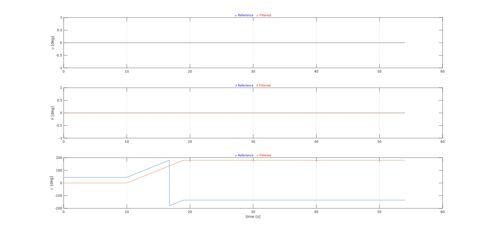

As expected, since $\beta = 0 $ there is no correction, algorithm will relie only on the sensor reading of gyroscope.

**Beta = 0.2**
Now the algorithm correction is used since $\beta = 0.2$ and it will be compared with the previous result. Then it will be added bias and/or noise to see the response while still using ideal measurments for accelerometer and magnetometer.

This presents several things to analyse. First, the algorithm takes about 2.32 seconds to converge to initial orientation. The convergence step in the first seconds is the declination of a slope in the $\psi$ angle. This is due to the single step correction per sample and because of the step being normalized. As the initial error is also big, it will afect also the other euler angles (max error around 9 degrees). After stabilization, the error in other angles is greatly decreased (see time between 10 and 19 seconds). A zoom section is presented now.

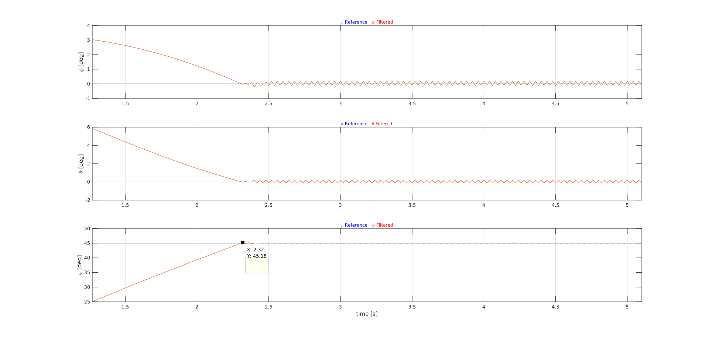

In the zoom section it is seen the typical behavior of gradient descent algorithm where it will oscillate around the ideal minimum.
If beta is big, it will initially converge quickly, but can also lead to greater oscillation error.

Let us compare now the effect of increasing $\beta$:

|                                     |
|:-----------------------------------:|
|$\beta = 0.3$                        |
||
|$\beta = 0.4$                        |
||
|$\beta = 0.5$                        |
||

The initial convergence is faster, but the oscilation tends to increase and be more reactive to small changes. For comparisson, lets use side by side with $\beta = 0.2$ and $\beta = 1$

|0.2 | 1|
|:--:|:--:|
|  | 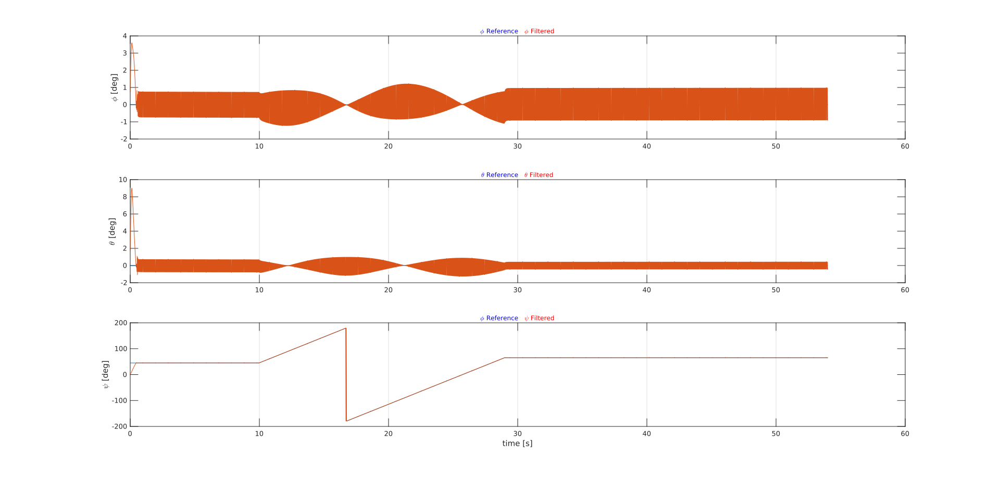|

#### 7.1.2 adding noise to gyroscope ####
Selecting $\beta=0.3$ we will add noise to measurements of gyroscopes.
It will be added first just gaussian noise with several values of standard deviation in degrees in each gyroscope channel measurements. This time, the output of Mahony filter, in wich Madgwick is based, is also added with $Kp = 20$ and $Ki = 0.01$ (Recall that the derivation of Mahony filter is basically the same but the correction is made using a PI approach instead gradient descent)
The initial orientation will be considerated  $[\psi, \theta, \phi] = [0,0,0]$.

| Euler Angles                    | Error                                   |
|:-------------------------------:|:---------------------------------------:|
| $\sigma = 0.1$                  | $\sigma = 0.1$                          |
|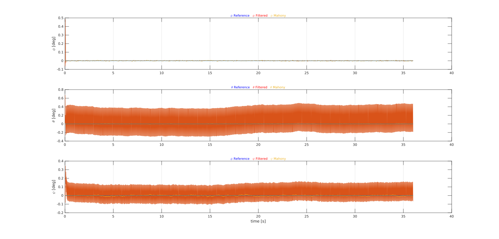 |   |
| $\sigma = 1$                    | $\sigma = 0.1$                          |
|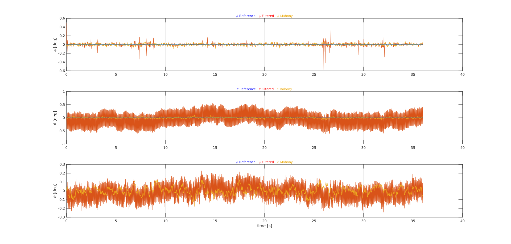   |     |
| $\sigma = 2$                    | $\sigma = 2$                            |
|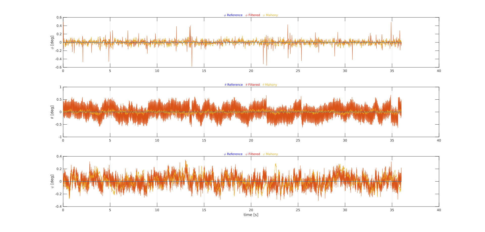   |     |
| $\sigma = 24.3085$              | $\sigma = 24.3085$                      |
|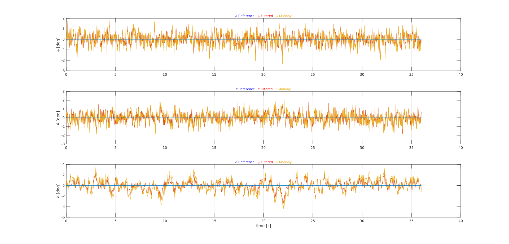   | 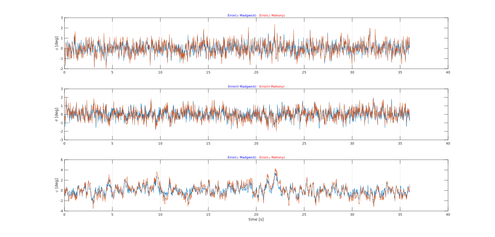    |

**Note:** The value of $\sigma = 24.3085$ corresponds to the deduced value needed to generates $\beta = 0.3$ according to the formula derived in [5.3](#53-filter-gains)

Now, let us use bias in the readings, with no standard deviation.

| Euler Angles                    | Error                                   |
|:-------------------------------:|:---------------------------------------:|
| $\omega_b = 0.1$                | $\sigma = 0.1$                          |
| |   |
| $\omega_b = 1$                  | $\omega_b = 1$                          |
|   | 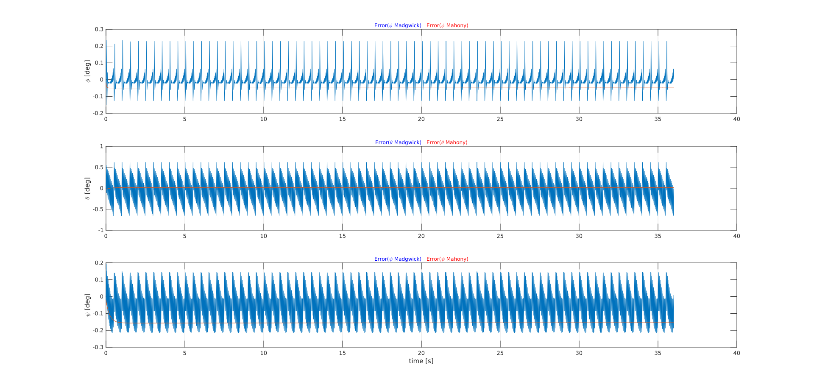    |
| $\omega_b = 2$                  | $\omega_b = 2$                          |
|   |     |
| $\omega_b = 1.2728$             | $\omega_b = 1.2728$                     |
|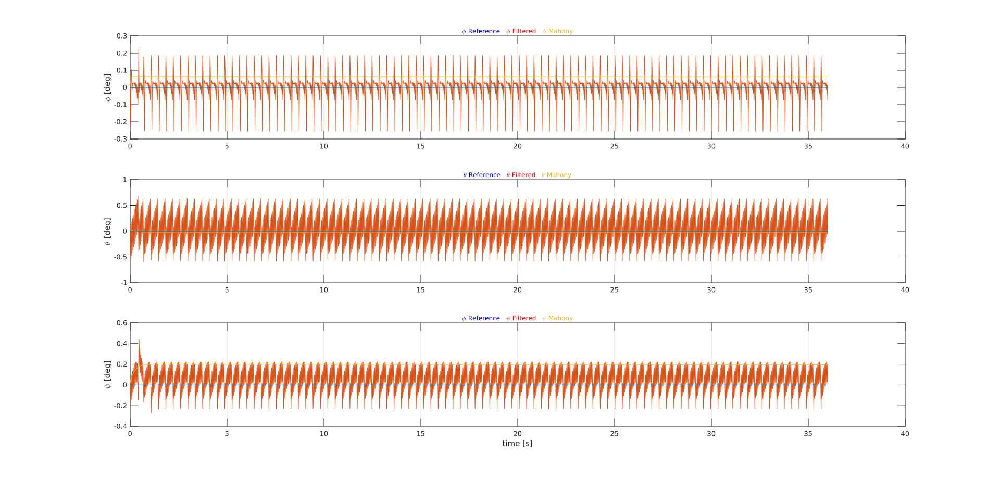| |

#### 7.1.3 adding noise to accelerometer ####

Since accelerometer can not provide corrections to the $\psi$ euler angle, a initial value of $\theta=\pi/6$ will be introduced. Using ideal gyroscope measurements, only gaussian noise will be added to accelerometer.

| Euler Angles                    | Error                                   |
|:-------------------------------:|:---------------------------------------:|
| $\sigma = 0.01$                 | $\sigma = 0.01$                         |
|     | 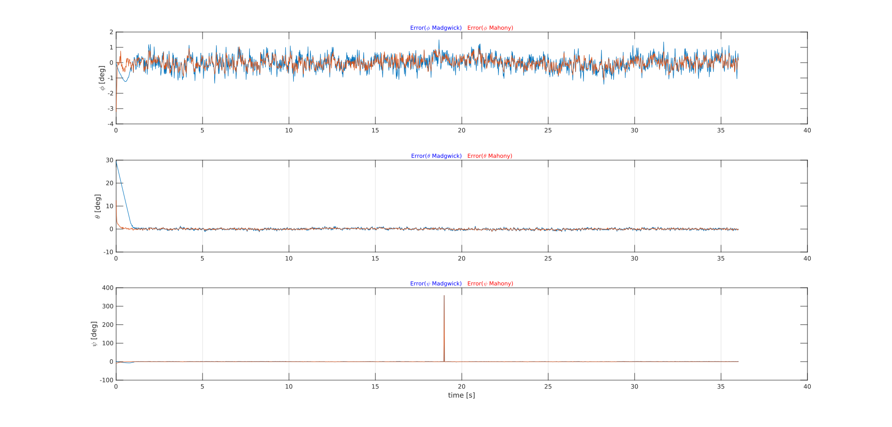      |
| $\sigma = 0.02$                 | $\sigma = 0.02$                         |
|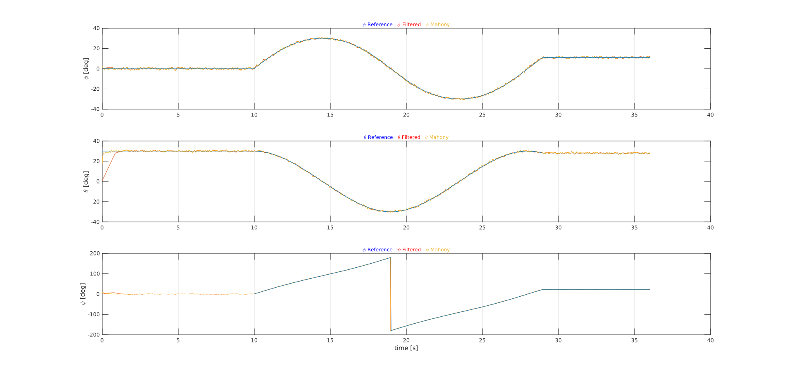     |       |
| $\sigma = 0.1$                  | $\sigma = 0.1$                          |
|      | 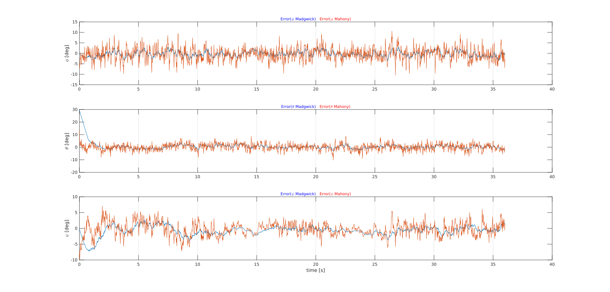       |

#### 7.1.4 adding noise to magnetometer ####

Using ideal gyroscope measurements, only gaussian noise will be added to magnetometer.

| Euler Angles                    | Error                                   |
|:-------------------------------:|:---------------------------------------:|
| $\sigma = 0.01E4$               | $\sigma = 0.01E4$                       |
|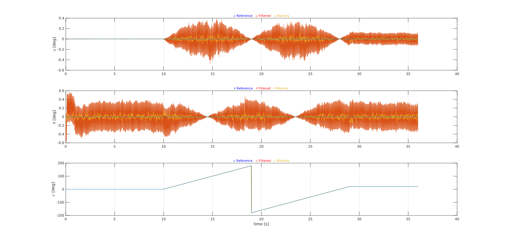   |     |
| $\sigma = 0.10E4$               | $\sigma = 0.10E4$                       |
|   | 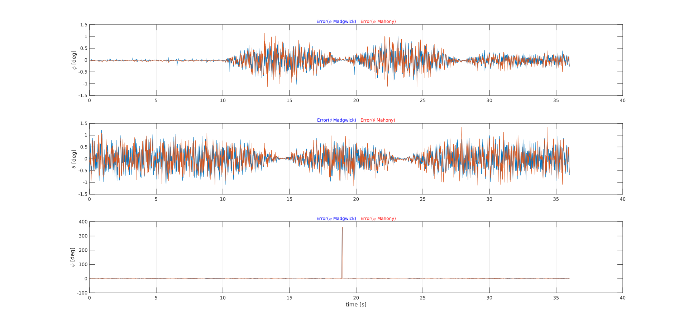    |
| $\sigma = 0.2E4$                | $\sigma = 0.2E4$                        |
|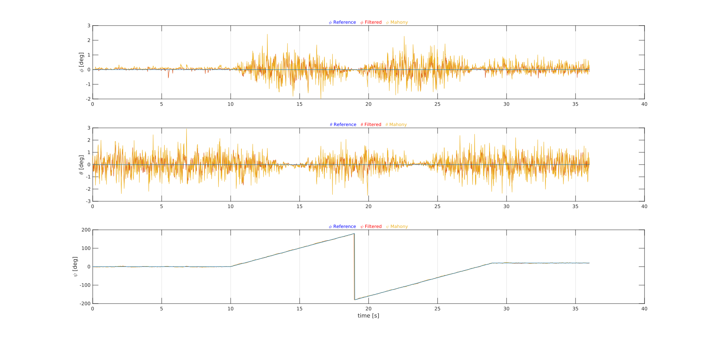   |     |

#### 7.1.4 all together ####

| Euler Angles                    | Error                                   |
|:-------------------------------:|:---------------------------------------:|
|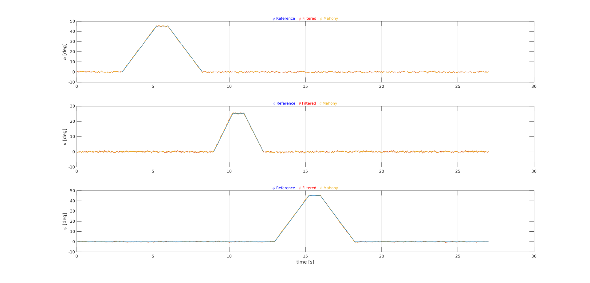          |            |

### 7.2 Gyro bias correction ###

Although the gyroscope bias correction is not submitted into the IEEE paper, is present in the thesis, so it will be tested in this section.
The gyroscope will be defined with the 0.38 rms for gaussian noise and 0.1643 for bias. This values are infered from the ITG3200 datasheet.
Measurement sensors will be first considerated ideal.

The comparisson between bias correction vs non bias correction is using static position and initial euler angles equal to zero since we are interested in see what happens if bias is not zero mean.

| Euler Angles                    | Error                                   |
|:-------------------------------:|:---------------------------------------:|
| $\zeta = 0.01 $                 | $\zeta = 0.01 $                         |
|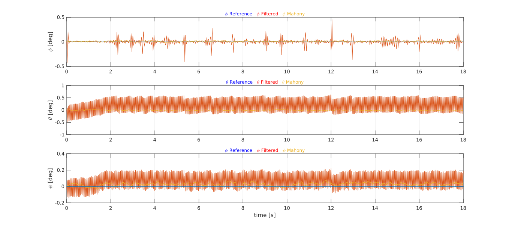   |     |
| $\zeta = 0 $                    | $\zeta = 0 $                            |
|  |
| $\beta = 0.0057, \zeta=0.0025$  | $\beta = 0.0057, \zeta=0.0025$          |
| |  |

Gyroscope bias that affect angle random walk is considerated to be a slow changing dynamic. The following set of tests are used for a long stability analyses (30mins duration)

| Euler Angles                    | Error                                   |
|:-------------------------------:|:---------------------------------------:|
| $\zeta = 0.0025, \beta=0.3$     | $\zeta = 0.0025, \beta=0.3$                        |
|   |     |
| $\beta = 0.0057, \zeta=0.0025$  | $\beta = 0.0057, \zeta=0.0025$          |
| |  |
| $\beta = 0.3, \zeta=0$  | $\beta = 0.3, \zeta=0$          |
| |  |

It is noticed by looking into first images that the filter slowly converge to the bias value as opposed to the filter with $\zeta = 0$. However, as long as calibratrion is done correct at begin to remove bias after achieveing thermal stability, the change in bias can  be really small and algorithm, even without $\zeta$ will eventually correct the angles due to increase of error and for many applications this error can be accepted.

### 7.3 Injecting External acceleration ###

As said before, since the algorithm do not check for the magnitude of accelerations because of the intended use for human body where it would be of small duration and weak, it should be affect by values not near the expected range.

| Accelerometer                   | Euler Error                             |
|:-------------------------------:|:---------------------------------------:|
| 0.05g external accelerations    | 0.05g external accelerations            |
|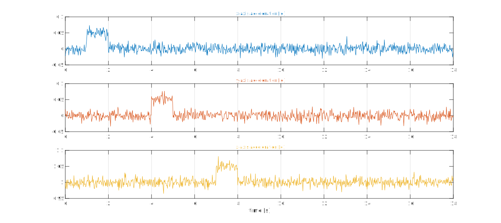    | 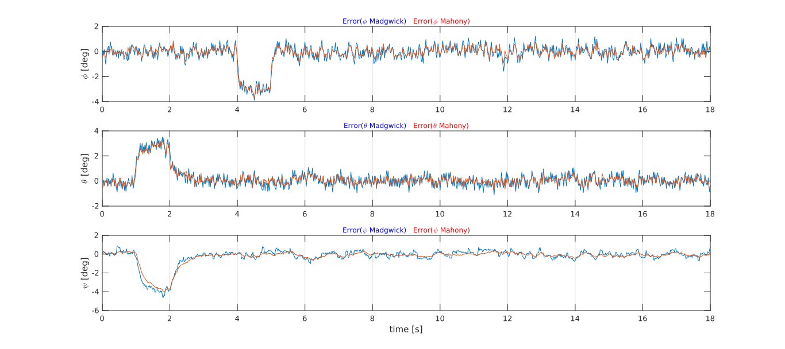     |
| 0.1g external accelerations     | 0.1g external accelerations             |
|    | 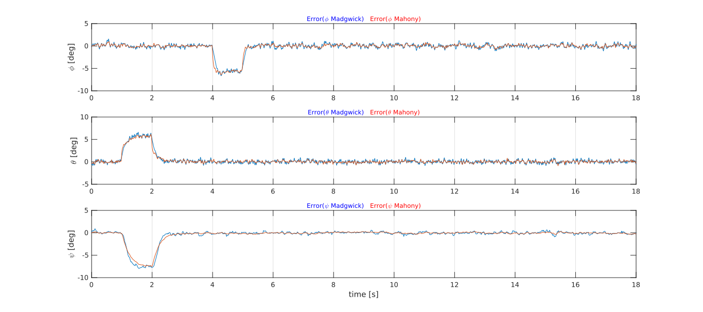     |
| 0.01g external accelerations    | 0.01g external accelerations            |
|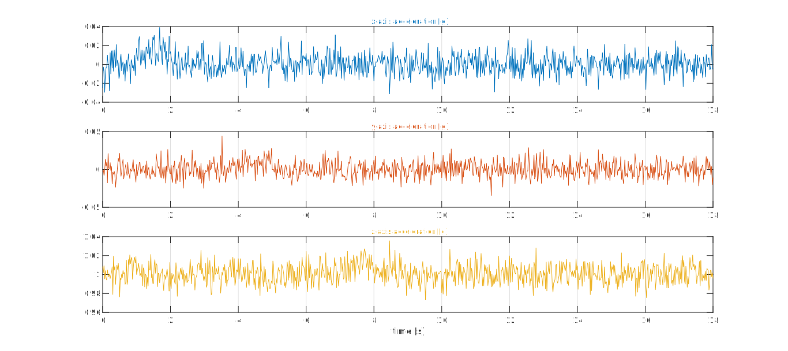    |      |

From these figures is clear the algorithm suffers from external accelerations. It is also noticed that if magnitude of added is in the order of the accelerometer noise, changes are unnoticed. It also noticed that if accelerations are only present in the z-axis, as long near horizontal, it will not affect the error because acceleration vector of acceleration is a scaled version of gravity vector.

#### 7.3.1 Improve algorithm to handle External acceleration ####

Let us define a threshold for assuming the presence of external accelerations. This value can be adjusted as needed.
$$
extAcc = \begin{cases}
1 &, \|{^b}a\| = 1\pm K\sigma_{max} \\
0 &, \text{otherwise}
\end{cases}
$$

In the cases where $extAcc$ is true, the correction is not applied or is applied only based on magnetometer. For simplicity, let us say by now that even magnetometer readings are not valid since it will be studied the case after. In this case the quaternion update would relie only on gyroscopes measurements. The gyroscope should stable enougth for small periods so this means the updates can be trusted.
Using this assumption, results in the following pseudo-code:

$$
\begin{array}{ll}
\text{if}(extAcc):\\
  &\begin{array}{rl}
  {^b_w}q_{w,t} &= {^b_w}\hat{q}_{est,t-1} +  {^b_w}\dot{q}_{w,t} \Delta t \\
  {^b}g_{est,t} &= {^b_w}q^\star_{w,t} \otimes {^w}g \otimes {^b_w}q_{w,t} \\
  {^b}a_{linear} &= {^b}a - {^b}g_{est,t}
  \end{array}
  \\
\text{else}:\\
  &\text{correct as usual}\\
  &{^b}g_{est,t} = {^b}a \\
  &{^b}a_{linear} = [0\ 0\ 0\ 0]\\
\text{end}
\end{array}
$$

If we considerate the magnetometer is still valid, we can still use the correction provided by it.

| handle External acceleration results                                        |
|:---------------------------------------------------------------------------:|
| Accelerations                                                               |
|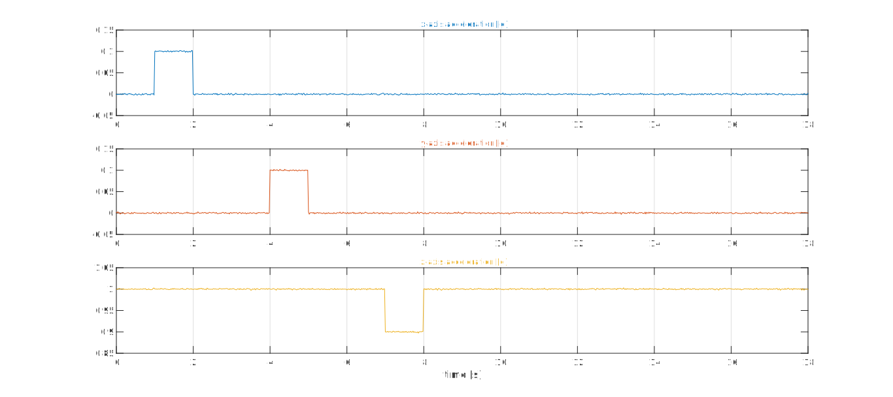                                            |
| Euler angles using only gyroscopes                                          |
|                                |
| Error using only gyroscopes                                                 |
|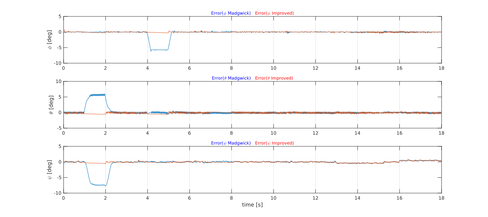                                |
| Euler angles using also magnetometer                                        |
|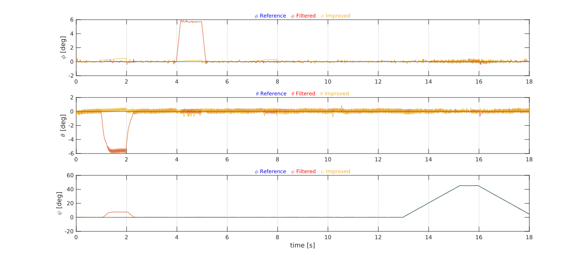                                          |
| Error using also magnetometer                                               |
|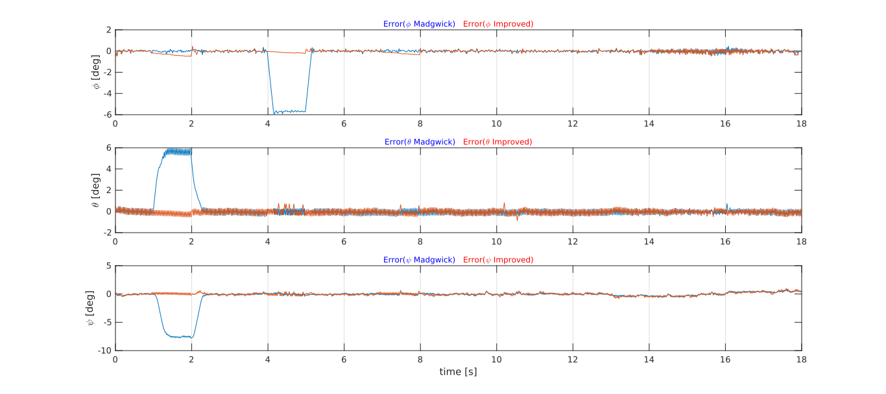                                          |

### 7.3 Injecting External magnetic distortion ###

Similar to the accelerations, unexpectd temporary distortions caused in the magnetic field can be detected and removed using the same principle as previously with accelerometer.

$$
extMag = \begin{cases}
1 &, \|{^b}m\| = \|\vec{H_{w}}\|\pm K\sigma_{max} \\
0 &, \text{otherwise}
\end{cases}
$$

and similar, if $extMag$ is present, update only using gyroscopes with accelerometer correction (if usable).

| handle External magnetic distortions results                                |
|:---------------------------------------------------------------------------:|
| Magnetic Field                                                              |
|                                            |
| Euler angles using corrections                                              |
|                                          |
| Error using  corrections                                                    |
|                                          |

---
<a href="./testing_madgwick_part2.html">Continue to part 2</a>
