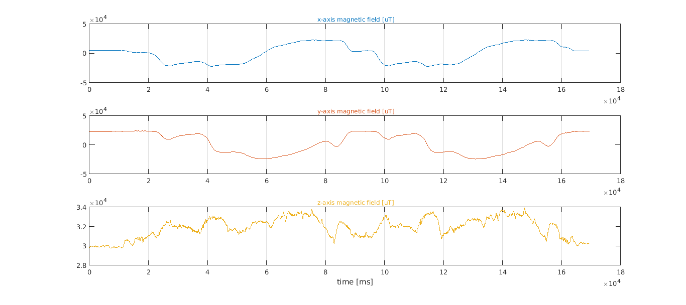
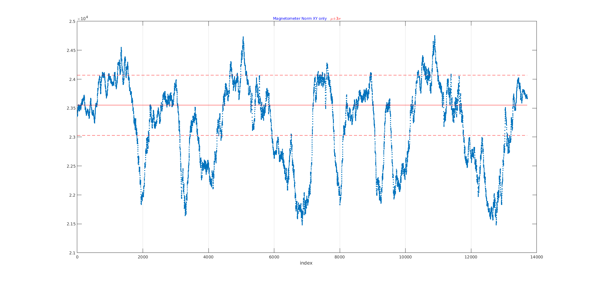
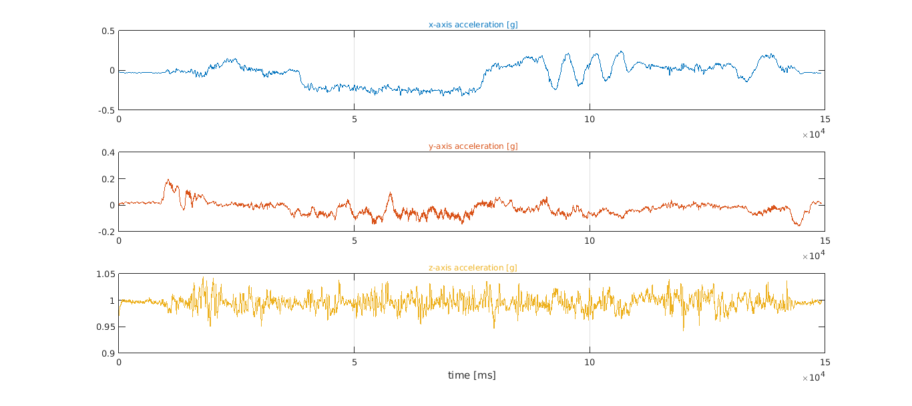
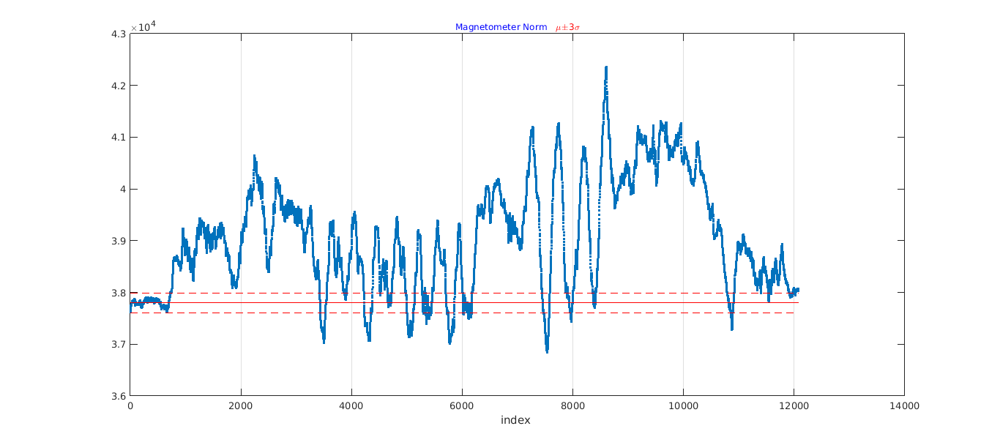
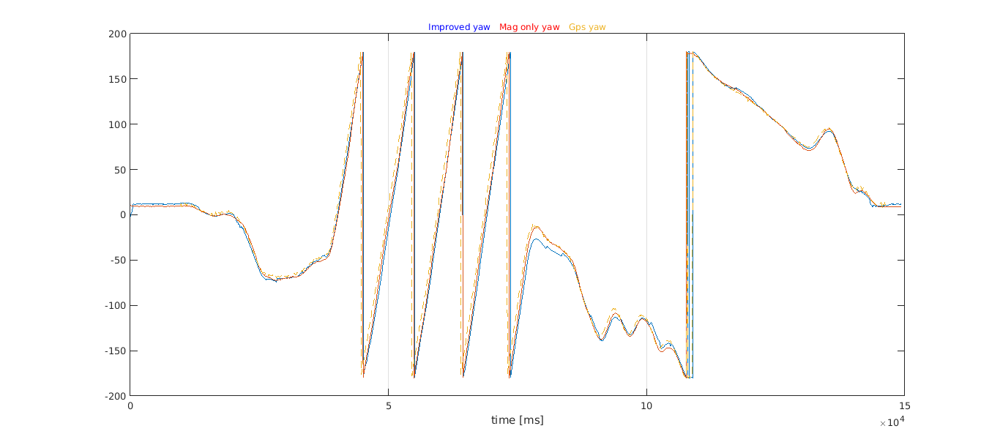
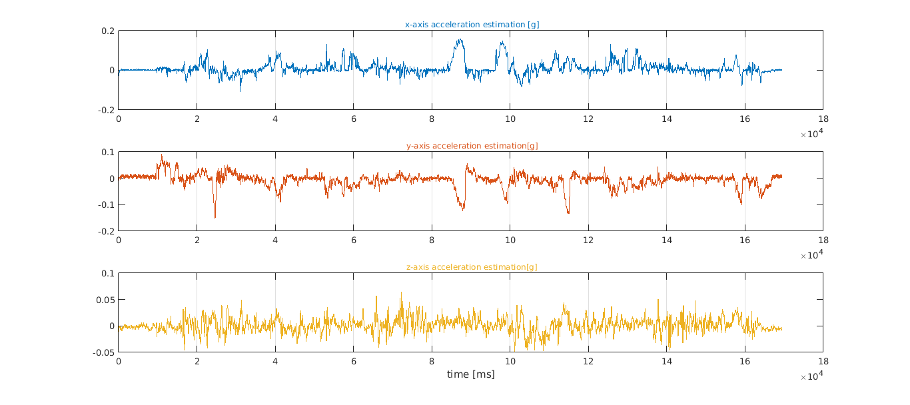
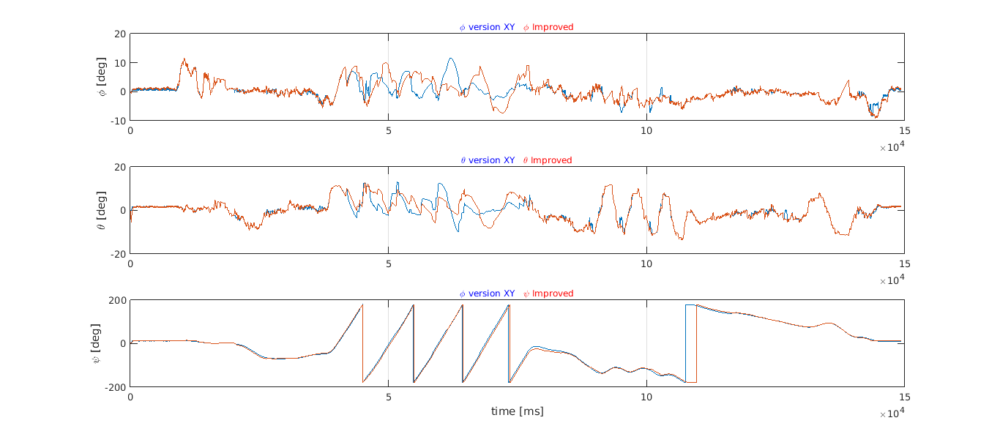
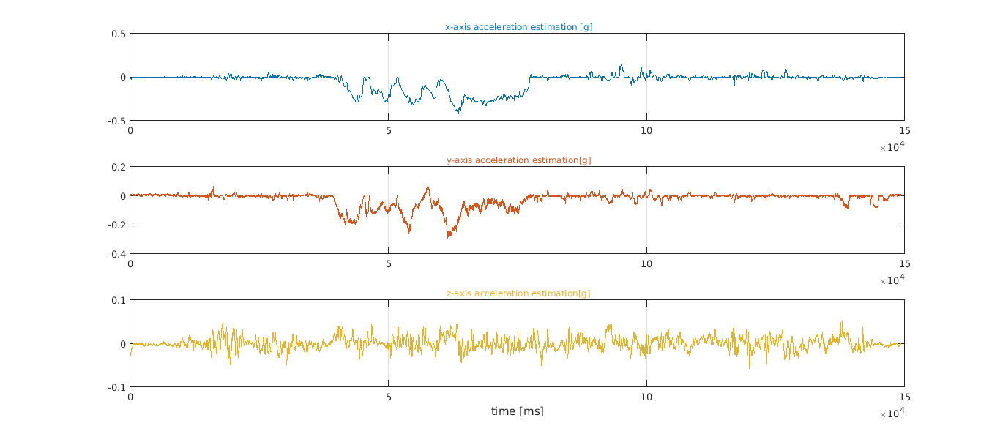

<!-- untoc -->
# Understanding Sebastian Madgwick MARG filter - Part 2

<!-- toc orderedList:0 depthFrom:1 depthTo:6 -->

* [8 Testing algorithm - real data](#8-testing-algorithm-real-data)
  * [8.1 Test 1](#81-test-1)
  * [8.2 Test 2](#82-test-2)
* [9 Change algorithm to use only magnetometer X and Y axis](#9-change-algorithm-to-use-only-magnetometer-x-and-y-axis)
  * [9.1 Results for test 1](#91-results-for-test-1)
  * [9.2 Results for test 2](#92-results-for-test-2)
* [10 Results for real road test](#10-results-for-real-road-test)

<!-- tocstop -->
---
## 8 Testing algorithm - real data ##

For the tests, the real data was collected using a Sparkfun razor 9dof v.10125 and gnss signals from Novatel Flexpak G2. The image below show us the ENU position collected using the gnss sensor.
The car was moving in a paved road but with some debris present in the first tests with no buildings in the sorrounding areas and with small trees in some parts of the circuit. The last test was made in urban enviroment. A few portionsof the circuit had close buildings in both sides and lots of cars parked also. At least one portion of the circuit had an high inclination.

### 8.1 Test 1 ###

The following image show the XY ENU coordinates where the data is collected.

The test consisted in moving along the track two times in the clockwise direction starting from position (0,0).
Next is present the euler angles estimated by the algorithm with no corrections and also the Mahony version.

But now, let us show the accelerometer and magnetometer readings and the respective norms also.

| Accelerometer                     | Magnetometer                             |
|:---------------------------------:|:----------------------------------------:|
|         |                |
| **Norm Accelerometer**            | **Norm Magnetometer**                    |
|      |            |

It is clear the presence of accelerations, so as seen in the simulations, it is expected to behave badly. The Z-axis is considerated well behaved. The acceleration relatively constant in this axis around 1g. The Y axis (pointing front of the car) would represent the linnear acceleration of the vehicle. During the first two seconds, when the movement starts, it is possible to see the initial accelerations and possible gear shifts. Also at the end, is clearly seen the vehicle stoping. During the the rest of the movement, the small fluctuation around rest position value can be considerated normal due to the difficult of making the gas static.

The x-axis takes much more fluctuation wich seems consistent with vehicle turns and, as expected, should represent the centrifugal acceleration and possible suspention movement (the last term may also affect y-axis)

Looking for the norm of accelerations, it is seen that lot os samples relie in the expected interval of ~1g mean and 99% interval of confidence ($\mu \pm 3\sigma$) calculated within the no movement initial period (around 700 first samples).

However, looking at the magnetometer, norm of it is majority outside the initial no movement estimated mean and 99% IC. Does it mean the magnetic field varies so greatly between small location of the track? It was expected to not, there was no buildings, cars or other clear sources of magnetic fields or capable of interfering with earth magnetic field. Recalling the fact that magnetometer was unable to be calibrated in the z direction, it is believed that this is the major source of this unexcepcted out of range norm and z great variance.
This will result only in a few samples will be actually used by improved version to correct the yaw angle and the system will relie in the majority of time on the gyroscopes integration for the yaw angle, wich is not advised.
However since the calibration was possible in XY plane, another version of the algorithm can be derived, where instead of looking for the norm of magnetometer vector, only the norm of X and Y components are used.

| Magnetometer (Norm XY)            | Magnetometer (Norm of all)               |
|:---------------------------------:|:----------------------------------------:|
|  |           |
| **Euler angles**                  | **Euler angles**                         |
|  | 

Using norm for XY axis only, many samples from magnetometer can now be used in the correction.

Comparing now the results for the yaw angle, using the norm of all components vs norm of XY axis only:

| Magnetometer (Norm XY)            | Magnetometer (Norm of all)               |
|:---------------------------------:|:----------------------------------------:|
|  |           |

It seems the version using magnetometer norm of XY axis only, creates a delay when rapid change occurs (see peaks around 6 seconds) but near stationary orientation the filter, the xy version seems to track better than normal version (see around 5, 9, 11 ,15 seconds ). In red is marked the simple yaw estimation from the magnetometer XY-axis given by:
$$
\psi = atan2(m_x, m_y) + D
$$
where $D$ is the local magnetic declination and $m_x,m_y$ the measurements of magnetometer in axis X and Y in the body frame, given the possible calibration.

### 8.2 Test 2 ###
The new test is basically the same as previous but a serious of turns was made, trying to hold the steering wheel as fixed as humanly possible.

| Accelerometer                     | Magnetometer                             |
|:---------------------------------:|:----------------------------------------:|
|    |           |
| **Norm Accelerometer**            | **Norm Magnetometer**                    |
| |       |

Again is clear the presence of external acceleration and during the circular turns is clear the presence of centrifugal acceleration.

| Magnetometer (Norm XY)            | Magnetometer (Norm of all)               |
|:---------------------------------:|:----------------------------------------:|
|  |           |
| **Euler angles**                  | **Euler angles**                         |
|  | 

Here the must interesting point is the fact that, during the turns, the improved versions output of yaw angle is valrying approximate linear as expected when compared to the simple version of Madgwick algorithm.

But if we look at yaw angle only, when the movement is changing rapidly, as before in [8.1](#81-test-1), they seems not converge quickly enougth.

| Magnetometer (Norm XY)            | Magnetometer (Norm of all)               |
|:---------------------------------:|:----------------------------------------:|
|  |      

## 9 Change algorithm to use only magnetometer X and Y axis ##

By looking to plots of euler yaw angle estimated by only using the X and Y axis of magnetometer readings it seems most of the time, the estimate was following better the assumed correct reference given by the velocity of gnss.
Since the objective is to used with a car, does the car is approximate near the horizontal plane?
In order to achieve the answer looking at the road structure official guidelines[1](#f1). The advized maximum percentage of inclination for roads is expressed
in the following table:

|Base velocity (km/h)| Max. Inclination advice (%) |
|:------------------:|:---------------------------:|
| 40 | 8 |
| 60 | 7 |
| 80 | 6 |
| 100| 5 |
| 120| 4 |
| 140| 3 |

**NOTES:** for autoroutes the maximum inclination should be 3%. This inclinations can be surpassed as long as it is for a limited distance. Municipal roads can also surpasse this values but is also advised to be used.

Let us calculate the result in degrees for the percentages using
$$
angle = \arctan(\frac{percentage}{100})
$$
| Max. Inclination advice (%) | Angle (degrees)    |
|:------------------:|:---------------------------:|
| 15|8.53|
| 10|5.71|
| 8 |4.57|
| 7 |4.00|
| 6 |3.43|
| 5 |2.86|
| 4 |2.29|
| 3 |1.72|

Using this, we can assume the car inclination angles are small enougth, or by other words, the car is near the horizontal plane, in order to the magnitude of z-axis of the magnetic field create a significant influence.
For instance, the change in horizontal magnitude due to angle of 5.71 degrees, in Lisbon (2017) would be
$$
\begin{array}{ll}
error &= 26500.6(1-\cos(5.71^o)) \\
&= 131.4901[nT]
\end{array}
$$
That said, let us change the section of magnetometer for the matrices  *f* and *J* for taking only account of the horizontal component of earth magnetic field (see section 5.1 and 4.3 of <a href="./testing_madgwick.html">part 1</a>).
The new vector ${^w}\hat{h}$ will then become:
$$
\begin{array}{ll}
{^w}\hat{d} &= {^w}\hat{h} \\
      \\
      &= [0\quad 0\quad h_y\quad 0] \\
      \\
      &= [0\quad 0\quad \cos(I)\quad 0] \\
      \\
      &= [0\quad 0\quad 0.6049\quad 0]
\end{array}
$$

and normalizing again will result in:${^w}\hat{h}=[0\quad 0\quad 1\quad 0]$

For every reading in magnetometer it will be used:
$$
{^b}\hat{m} = [0\quad m_x\quad m_y\quad 0]
$$
so that also the resulting normalization will only reflect the components XY - axis.
The new $f_h$ and $J_h$ matrices will be:

$$\begin{array}{ll}
f( {^b_w}\hat{q}_k,{^w}\hat{h}, {^b}\hat{m}) &= f_h( {^b_w}\hat{q}_k, {^w}\hat{h}, {^b}\hat{m})=\\
\\
      &=\begin{bmatrix}
          2(q_1q_4+q_2q_3)            - m_x \\
          2(\frac{1}{2} -q^2_2-q^2_4) - m_y \\
          2(q_3q_4 -q_1q_2)           - 0
        \end{bmatrix}
\end{array}
$$
$$\begin{array}{ll}
J( {^b_w}\hat{q}_k,{^w}\hat{d}) &= J_h( {^b_w}\hat{q}_k,{^w}\hat{h})=\\
\\
  &=\begin{bmatrix}
      2q_4  & 2 q_3  & 2q_2  & 2q_1 \\
      0     &-4q_2   & 0     &-4q_4 \\
     -2q_2  &-2q_1   & 2q_4  & 2q_3
    \end{bmatrix}
\end{array}
$$

### 9.1 Results for test 1 ###

|Euler angles (version XY axis only vs Improved)     |
|:--------------------------------------------------:|
| |
|**Yaw Angle**                                       |
|    |
|**External Accelerations estimation**               |
|         |

### 9.2 Results for test 2 ###

|Euler angles (version XY axis only vs Improved)     |
|:--------------------------------------------------:|
| |
|**Yaw Angle**                                            |
|    |
|**External Accelerations estimation**                    |
|         |

## 10 Results for real road test ##
This test was made in a normal road with sections where buildings and lots of cars are parked in the road sides. Also one section includes a slope with significant inclination.
| Map locations for road test    |
|:--------------------------------------------------:|
||
||

|Euler angles (version XY axis only vs Improved)     |
|:--------------------------------------------------:|
| |
|**Yaw Angle**                                            |
|    |
|**External Accelerations estimation**                    |
|         |

<iframe width="853" height="480" src="https://www.youtube.com/embed/d4yVI4hnM34?rel=0" frameborder="0" allowfullscreen ></iframe>

<b id="f1">[1]</b> [Norma De Tracado, p.34](http://www.imt-ip.pt/sites/IMTT/Portugues/InfraestruturasRodoviarias/InovacaoNormalizacao/Divulgao%20Tcnica/RevisaoNormaDeTracado.pdf). [↩](#a1)

[Wikipedia source](https://en.wikibooks.org/wiki/Fundamentals_of_Transportation/Grade#Grade_Computation)
