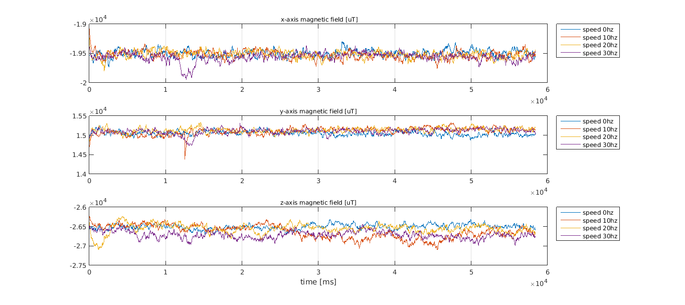

# Teste de influência do motor eléctrico no magnetómetro #

Série de testes com o motor eléctrico a rodar a várias velocidades através do controlo de V/F.
O objectivo é determinar se a variação do campo electromagnético do motor poderá influenciar de forma significativa o uso do magnetómetro para a estimação da orientação do carro.

Frequências testadas:

+ 0Hz
+ 10Hz
+ 20Hz
+ 30Hz

As variações do campo em relação às várias velocidades não parecem influenciar demasiado o valor médio do campo magnético em cada eixo do sensor, pelo que se espera que os algoritmos desenvolvidos para o carro de combustão também possam ser replicados no carro eléctrico.

