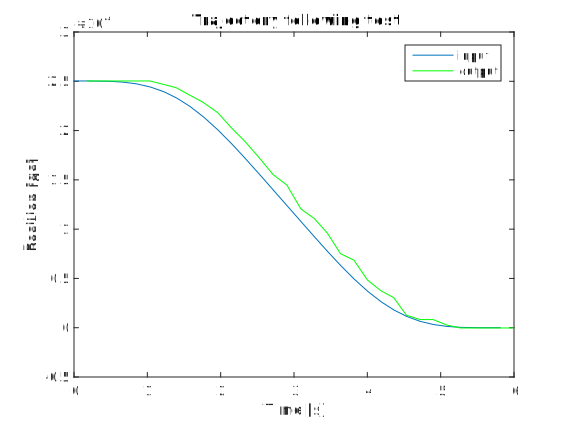
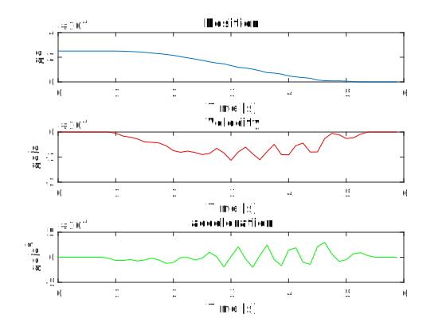
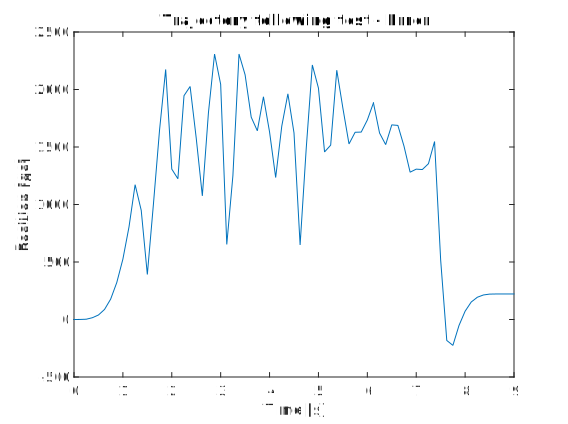
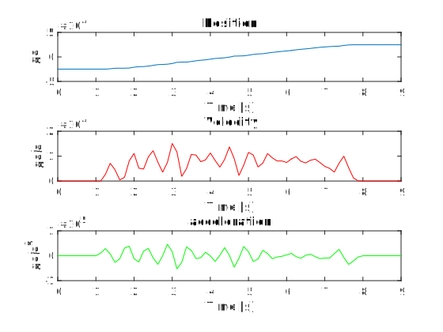

<!-- untoc -->
# Resumos de testes com o volante #

<!-- toc orderedList:0 depthFrom:1 depthTo:6 -->

* [1. Sine following](#1-sine-following)
  * [1.1 Interior  do laboratório](#11-interior-do-laboratório)
  * [1.2 Exterior do laboratório.](#12-exterior-do-laboratório)
* [2. Chirp following](#2-chirp-following)
  * [2.1 Interior  do laboratório](#21-interior-do-laboratório)
  * [2.2 Exterior do laboratório](#22-exterior-do-laboratório)
* [3. Trajectory follower](#3-trajectory-follower)

<!-- tocstop -->

## 1. Sine following ##
Série de testes usando uma onda sinusoidal para definir a posição desejada do volante.

### 1.1 Interior  do laboratório ###

|ganhos|test1.mat|test2.mat|test3.mat|test4.mat|test5.mat|test6.mat|test7.mat|test8.mat|test9.mat|
|------|:-------:|:-------:|:-------:|:-------:|:-------:|:-------:|:-------:|:-------:|:-------:|
| P    |9        |9        |9        |10       |12       |15       |9        |13       |15       |
| I    |0        |0        |0        |0        |0        |0        |0        |0        |0        |
| D    |1        |1        |1        |1        |1        |1        |2        |2        |3        |
| vFeed|0        |0        |0        |0        |0        |0        |0        |0        |0        |
| aFeed|0        |0        |0        |0        |0        |0        |0        |0        |0        |
|Period|10       |7.5      |5        |10       |10       |10       |10       |10       |10       |

**teste1.mat**

**teste2.mat**

**teste3.mat**

**teste4.mat**

**teste5.mat**

**teste6.mat**

**teste7.mat**

**teste8.mat**

**teste9.mat**

---

### 1.2 Exterior do laboratório. ###

| ganhos |sine01.mat|sine02.mat|sine03.mat|sine04.mat|
|:------:|:--------:|:--------:|:--------:|:--------:|
|P       |50        |50        |50        |50        |
|I       |1         |1         |1         |1         |
|D       |3         |3         |3         |3         |
|vFeed   |5         |5         |5         |5         |
|aFeed   |3         |3         |3         |3         |
|Period  |10        |8         |20        |20        |
|Turns   |1         |1         |1.5       |2         |

**sine01.mat**

**sine02.mat**

**sine03.mat**

**sine04.mat**

---

## 2. Chirp following ##
Série de testes usando uma função do tipo chirp para definir a posição desejada do volante.

A frequência varia linearmente de acordo com a fórmula:

$$f(t) = f_0 + kt $$
onde $k$ é definido como sendo:
$$ k = \frac{f_0-f_{end}}{T}$$
Pretende-se que a frequência do chirp varie desde 0 até à frequência máxima que será atingida no final do sinal então, tomando $f_0=0$ e $T = t_{end}$ resulta em:
$$f(t) = kt$$
$$k= \frac{f_{end}}{t_{end}}$$

### 2.1 Interior  do laboratório ###

**estão apenas representados alguns testes**

| ganhos  |chrip005.mat|chrip008.mat|chrip014.mat|chrip015.mat|
|:-------:|:----------:|:----------:|:----------:|:----------:|
|P        |30          |20          |50          |50          |
|I        |0           |1           |1           |1           |
|D        |5           |3           |3           |3           |
|vFeed    |0           |0           |5           |5           |
|aFeed    |0           |0           |2           |2           |
|$f_{end}$|0.1         |0.03        |0.03        |0.05        |
|Turns    |1.5         |1.5         |1.5         |1.5         |

**chirp005_ground.mat**
Neste exemplo nota-se que a corrente ficou limitada.

**chirp008_ground.mat**

**chirp014_ground.mat**

**chirp015_ground.mat**

### 2.2 Exterior do laboratório ###

<iframe width="853" height="480" src="https://www.youtube.com/embed/TmFjZiST00c?rel=0" frameborder="0" allowfullscreen></iframe>

| ganhos  |chrip01.mat|chrip02.mat|chrip03.mat|chrip04.mat|
|:-------:|:----------:|:----------:|:----------:|:----------:|
|P        |50          |50          |50          |50          |
|I        |1           |1           |1           |1           |
|D        |3           |3           |3           |3           |
|vFeed    |3           |5           |5           |5           |
|aFeed    |3           |5           |3           |3           |
|$f_{end}$|0.05        |0.05        |0.0667      |0.1         |
|Turns    |1.5         |1.5         |1.5         |1.5         |

**chirp01.mat**

**chirp02.mat**

**chirp03.mat**

**chirp04.mat**

---

## 3. Trajectory follower ##

Dois exemplos usando uma trajectória gerada automaticamente para atingir o ponto
final de acordo com as seguintes restrições:

* velocidade máxima durante a trajectória não pode exceder $\approx 211^o/s$ (limiar de oscilação)
* aceleração  máxima limitada a $6000 qc/s^2$. O valor é puramente impirico, mas tendo como referência o valor máximo de aceleração numa onda sinusoidal de periodo 1.7s (limiar da oscilação).
* a velocidade e aceleração nos pontos iniciais e finais devem ser zero.

Objectivo: gerar uma trajectória que seja suave, sem acelerações bruscas causando
baixos arranques (low and finite jerk).

As formulas utilizadas para desenho da trajectoria podem ser vistas em:
https://www.researchgate.net/publication/267794207_Motion_profile_planning_for_reduced_jerk_and_vibration_residuals

O epos contêm um método idêntico (motion profile mode) mas apenas garante velocidade igual a zero nas extermidades da trajectória.

**trajectory01.mat**

**trajectory02.mat**

